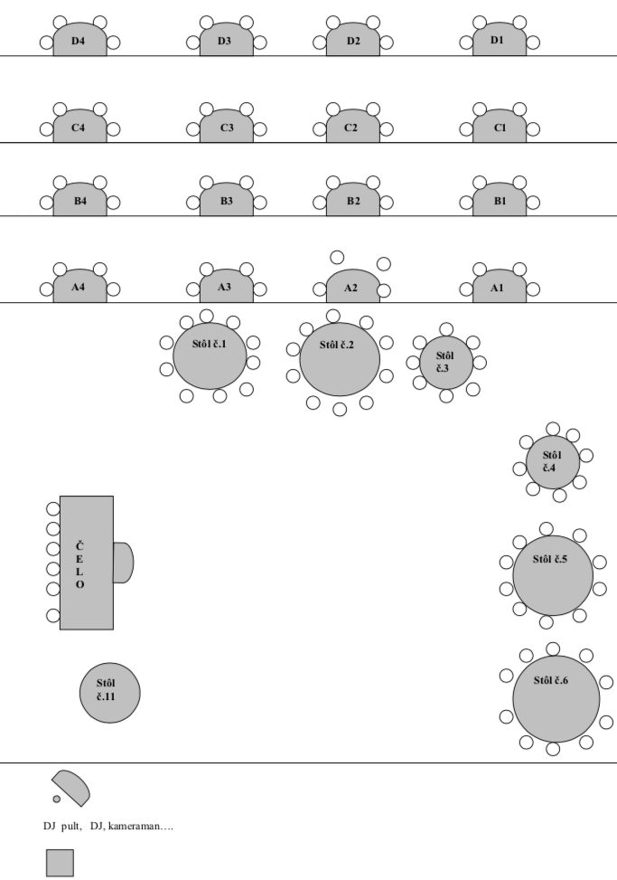

[<< späť](../)

# Zasadací poriadok

* Čelo

  1.  Ocko Jirko
  2.  Mamka Soňka
  3.  Nevesta Lenka
  4.  Ženích Vladko
  5.  Mamka Anka
  6.  Ocko Vlado
  7.  Braček Slavko

* Stôl č.1

  1.  Krstná Mária
  2.  Krstný Juraj
  3.  Miro Olejník
  4.  Marienka Olejníková
  5.  Michal Čuba
  6.  Marienka Čubová
  7.  Vlado Vitkaj
  8.  Zuzka Vitkajová
  9.  Dedko Janko
  10. Babka Anka

* Stôl č.2

  1.  Dušan Ščecina
  2.  Ilonka Ščecinová
  3.  Krstná Tonka
  4.  Krstný Jozef
  5.  Janka Šomjáková
  6.  Matúško Šomják
  7.  Emka Šomjáková
  8.  Tomáš Šomják
  9.  Marienka Kažová
  10. Táňa Budajová

* Stôl č.3

  1.  Maroš Rabik
  2.  Monika Hovancová
  3.  Nelka
  4.  Marienka Hrebíková
  5.  Laurinka
  6.  Tobiasko
  7.  Michal Hrebík
  8.  Janka Rabiková

* Stôl č.4

  1.  Milan Gmitro
  2.  Helena Gmitrová
  3.  Miluša Pavlíková
  4.  Jano Pavlík
  5.  Lucka Ženčuchová
  6.  Tamarka
  7.  Miro Ženčuch

* Stôl č.5

  1.  Oľga Kováčová
  2.  Štefan Kováč
  3.  Milenka Najduchová
  4.  Jano Najduch
  5.  Michal Kurty
  6.  Táňa Kurtyová
  7.  Jožko Skirka
  8.  Jana Skirková
  9.  Vojtech Boháč
  10. Partnerka

* Stôl č.6

  1.  Anička Veverková
  2.  Tomáš Veverka st.
  3.  Miloš Pavlík
  4.  Jakub Pavlík
  5.  Mirka Pavlíková
  6.  Saška Shamsaldeen Kurtyová
  7.  Yasminka
  8.  Jaafarko
  9.  Jojko
  10. Mammad Shamsaldeen

* A1

  1.  Lenka Pohlová
  2.  Kubko
  3.  Peťo Ferko

* A2

  1.  Paťo Čuba
  2.  Dominik Čuba
  3.  Janka

* A3

  1.  Mário Olejník
  2.  Daniela Kovalčíková
  3.  Mirka Olejníková
  4.  Rado Cibík

* B1

  1.  Michaela Fugová
  2.  Alica Fugová
  3.  Tomáš Fuga
  4.  Peter Fuga

* B2

  1.  Miro Kaža
  2.  Denisa
  3.  Erik Ščecina
  4.  Richard Ščecina

* B3

  1.  Braček Tomík
  2.  Dadka
  3.  Adélka
  4.  Tomáš Veverka ml.

* B4

  1.  Lukáš Vaško
  2.  Katka Vašková
  3.  Ivka
  4.  Milan Gmitro

* C1 - C4, D1 - D4

  > voľné

* Pódium

  1.  Juno 1
  2.  Juno 2
  3.  Juno 3
  4.  Juno 4
  5.  Lukáš Kolcun
  6.  Matej Ligač
  7.  Staff